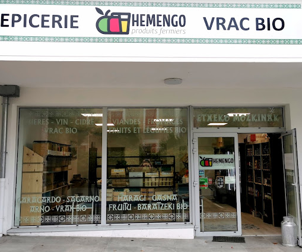

# Projet HemengoDistrib

<figure><figcaption></figcaption></figure>

### À propos du projet

HemengoDistrib est une start-up innovante qui souhaite révolutionner le processus de livraison en utilisant des distributeurs réfrigérés et connectés. Notre objectif est de connecter les producteurs locaux avec les consommateurs en fournissant une plateforme de commande en ligne conviviale, des distributeurs automatiques de produits frais et une gestion optimisée des stocks.

### Objectifs du projet

L'objectif global du projet HemengoDistrib est de concevoir et réaliser une solution informatique qui permettra :

* La gestion centralisée des distributeurs connectés, y compris la gestion des stocks, des commandes et des retraits.
* La création d'une application web et mobile conviviale pour les clients, leur permettant de commander des produits en ligne.
* La mise en place d'un système de paiement sécurisé, offrant plusieurs options telles que le paiement en ligne, par téléphone ou par carte bleue directement au distributeur.
* La fourniture d'une application de restockage pour le responsable du réapprovisionnement des distributeurs.

### Architecture du projet

L'architecture du projet HemengoDistrib est basée sur une approche moderne de développement et déploiement d'applications, en mettant l'accent sur les principes DevOps, l'intégration continue (CI) et le déploiement continu (CD).

* Le back-end de l'application est construit avec Node.js, utilisant une API REST pour communiquer avec la base de données MySQL.
* Le front-end est développé en React, offrant une interface utilisateur réactive et intuitive pour les applications web.
* L'application mobile est développée en utilisant React Native, permettant le déploiement sur les plateformes iPhone et Android avec un code partagé.

### Organisation de la documentation

Cette documentation est organisée de manière à vous guider à travers différentes sections, chacune couvrant un aspect spécifique du projet. Voici un aperçu des principales sections :

1. **Architecture** : Cette section fournit une vue d'ensemble de l'architecture du projet, en expliquant les composants principaux et leurs interactions.
2. **Configuration et déploiement** : Vous y trouverez des instructions détaillées pour la configuration de l'environnement de développement, ainsi que les étapes nécessaires pour déployer l'application sur différents environnements (développement, test, production).
3. **Utilisation de l'application** : Cette section vous guidera à travers les fonctionnalités de l'application, en vous montrant comment effectuer des commandes, effectuer des paiements et retirer les produits des distributeurs.
4. **Maintenance et gestion** : Vous y trouverez des informations sur la maintenance de l'application, la gestion des stocks, le suivi des commandes et d'autres tâches liées à l'exploitation du système.

Nous vous encourageons à explorer cette documentation et à utiliser les différents guides et références disponibles pour vous familiariser avec le projet HemengoDistrib et contribuer à son amélioration continue.

### Comment contribuer

Nous accueillons les contributions à cette documentation. Si vous trouvez des erreurs, des informations manquantes ou si vous souhaitez ajouter des fonctionnalités supplémentaires, n'hésitez pas à soumettre une demande d'extraction (pull request) sur le référentiel GitHub.

Pour plus d'informations sur la contribution à la documentation, veuillez consulter notre guide de contribution \[lien vers le guide de contribution].

Nous sommes ravis de vous avoir à bord et nous espérons que cette documentation vous sera utile tout au long de votre parcours avec le projet HemengoDistrib.

Commencez par explorer la section "Architecture" pour obtenir une vue d'ensemble complète du projet. Bonne lecture !
