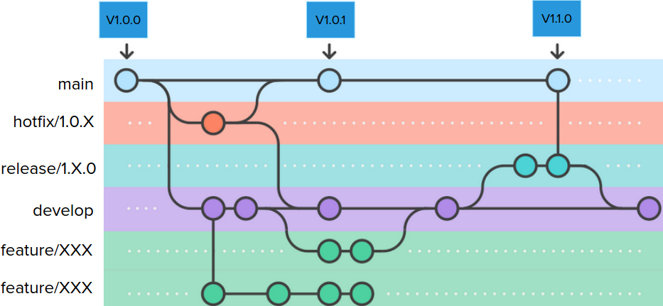
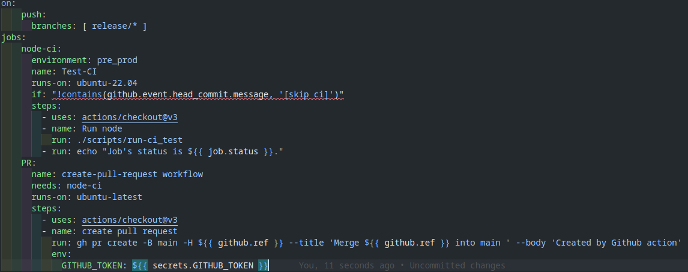

# GitHub workflow

HemengoDistrib workflow.

<div align="left">

<figure><figcaption></figcaption></figure>

</div>

## How to make your feature

#### 1. Make sure your are on the develop brach

```bash
    git checkout develop
```

#### 2.Update your develop branch

```bash
    git pull origin develop
```

**3.Create your feature branch**

```bash
    git checkout -b feature/1.0.5
```

**4.Make your changes**

<div align="left">

<figure><figcaption></figcaption></figure>

</div>

**5.Commit your changes**

```bash
    git add .
    git commit -m "Add fonction XXX"
```

**6.Checkout to develop branch**

```bash
    git checkout develop
```

**7.Update your develop branch**

```bash
    git pull origin develop
```

**8.merge**

```bash
    git merge --no-ff feature/1.05
```

**10.Push develop to GitHub**

```bash
    git push origin develop
```

## This Readme:

direct link:

[https://hemengodistrib.gitbook.io/docs/](https://hemengodistrib.gitbook.io/docs/)

Edition link:

[https://app.gitbook.com/o/y6FaMG4lcnLoVhxgPu5B/s/mtYFr2ObFGBEttW5x7HN/](http://localhost:5000/o/y6FaMG4lcnLoVhxgPu5B/s/mtYFr2ObFGBEttW5x7HN/)
